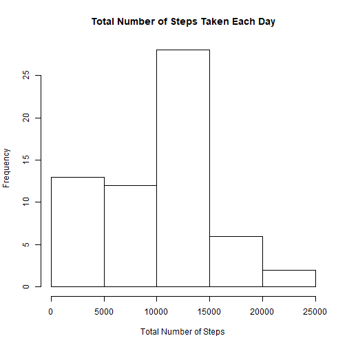
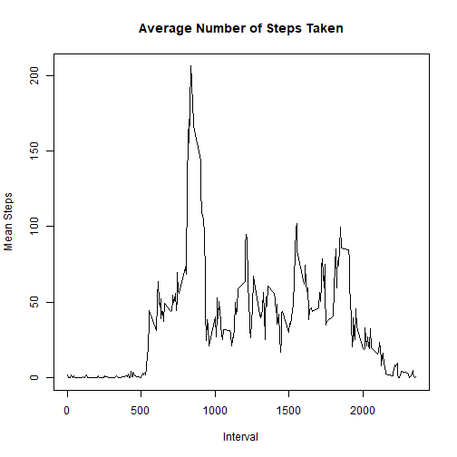
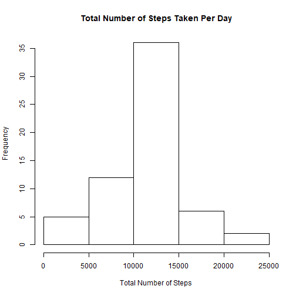
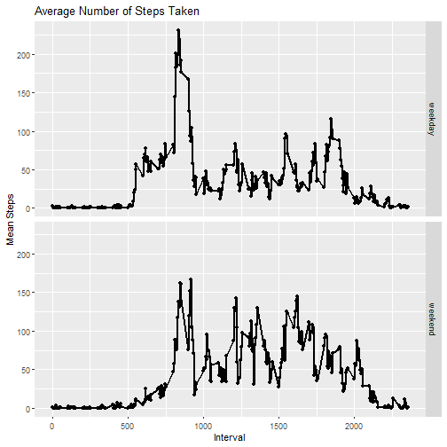

# REPRODUCIBLE RESEARCH : COURSE PROJECT 1


## Loading and preprocessing the data

Show any code that is needed to

1. Load the data (i.e. read.csv()).

2. Process/transform the data (if necessary) into a format suitable for your analysis


```r
# Loading the data
data <- read.csv("activity.csv", header = T)

# Checking the data
dim(data)
```

```
## [1] 17568     3
```

```r
str(data)
```

```
## 'data.frame':	17568 obs. of  3 variables:
##  $ steps   : int  NA NA NA NA NA NA NA NA NA NA ...
##  $ date    : Factor w/ 61 levels "2012-10-01","2012-10-02",..: 1 1 1 1 1 1 1 1 1 1 ...
##  $ interval: int  0 5 10 15 20 25 30 35 40 45 ...
```

```r
head(data)
```

```
##   steps       date interval
## 1    NA 2012-10-01        0
## 2    NA 2012-10-01        5
## 3    NA 2012-10-01       10
## 4    NA 2012-10-01       15
## 5    NA 2012-10-01       20
## 6    NA 2012-10-01       25
```

```r
tail(data)
```

```
##       steps       date interval
## 17563    NA 2012-11-30     2330
## 17564    NA 2012-11-30     2335
## 17565    NA 2012-11-30     2340
## 17566    NA 2012-11-30     2345
## 17567    NA 2012-11-30     2350
## 17568    NA 2012-11-30     2355
```

```r
# Checking the missing values
missing_data <- data[is.na(data$steps), ]
dim(missing_data)
```

```
## [1] 2304    3
```
## What is mean total number of steps taken per day?

For this part of the assignment, you can ignore the missing values in the dataset.

1. Calculate the total number of steps taken per day


```r
# Getting the data without missing values
data1 <- data[!is.na(data$steps), ]

# Calculating the total number of steps taken per day
total_number_steps <- with(data, tapply(steps, as.factor(data$date), sum, na.rm = T))
```

2. Make a histogram of the total number of steps taken each day


```r
hist(total_number_steps, main = "Total Number of Steps Taken Each Day",
     xlab = "Total Number of Steps")
```



3. Calculate and report the mean and median of the total number of steps taken per day


```r
summary(total_number_steps)
```

```
##    Min. 1st Qu.  Median    Mean 3rd Qu.    Max. 
##       0    6778   10395    9354   12811   21194
```

## What is the average daily activity pattern?

1. Make a time series plot of the 5-minute interval (x-axis) and the average number of steps taken, averaged across all days (y-axis)


```r
mean_steps <- with(data1, tapply(steps, data1$interval, mean))
interval <- levels(as.factor(data1$interval))
plot(interval, mean_steps, type = "l", main = "Average Number of Steps Taken", xlab = "Interval", ylab = "Mean Steps")
```



2. Which 5-minute interval, on average across all the days in the dataset, contains the maximum number of steps?


```r
table <- data.frame(mean_steps, interval)
table[table$mean_steps == max(table$mean_steps), ][2]
```

```
##     interval
## 835      835
```

## Imputing missing values

1. Calculate and report the total number of missing values in the dataset


```r
length(missing_data$steps)
```

```
## [1] 2304
```

2. Devise a strategy for filling in all of the missing values in the dataset. The strategy does not need to be sophisticated. For example, you could use the mean/median for that day, or the mean for that 5-minute interval, etc.


```r
# Strategy : Replacing the missing values by the average number of steps taken, averaged across all days
mean_steps <- with(data1, tapply(steps, data1$interval, mean))

missing_data$steps <- mean_steps
```

3. Create a new dataset that is equal to the original dataset but with the missing data filled in.


```r
new_data <- rbind(data1, missing_data)
new_data <- new_data[order(new_data$date), ]
```

4. Make a histogram of the total number of steps taken each day and Calculate and report the mean and median total number of steps taken per day. Do these values differ from the estimates from the first part of the assignment? What is the impact of imputing missing data on the estimates of the total daily number of steps?


```r
total_number_steps2 <- with(new_data, tapply(steps, as.factor(new_data$date), sum))

# Making a histogram of the total number of steps taken each day

hist(total_number_steps2, main = "Total Number of Steps Taken Per Day",
     xlab = "Total Number of Steps")
```



Calculate and report the mean and median of the total number of steps taken per day.

Mean and median total number of steps taken per day WITHOUT filling in the missing values:


```r
summary(total_number_steps)
```

```
##    Min. 1st Qu.  Median    Mean 3rd Qu.    Max. 
##       0    6778   10395    9354   12811   21194
```

Mean and median total number of steps taken per day WITH filling in the missing values:


```r
summary(total_number_steps2)
```

```
##    Min. 1st Qu.  Median    Mean 3rd Qu.    Max. 
##      41    9819   10766   10766   12811   21194
```

The mean and the median of the total number of steps taken per day for the new dataset differ from those of the original dataset.

## Are there differences in activity patterns between weekdays and weekends?

For this part the weekdays() function may be of some help here. Use the dataset with the filled-in missing values for this part.

1. Create a new factor variable in the dataset with two levels - “weekday” and “weekend” indicating whether a given date is a weekday or weekend day.


```r
# Creating a new factor variable
new_data$days <- weekdays(as.Date(new_data$date))


# Finding the weekends in the dataset
weekend_feature <- grep("Saturday|Sunday", new_data$days, ignore.case = T)

weekend_data <- new_data[weekend_feature, ]

weekend_data$weekday <- "weekend"

# Finding the weekdays in the dataset
weekday_feature <- grep("Saturday|Sunday", new_data$days, ignore.case = T, invert = T)

weekday_data <- new_data[weekday_feature, ]

weekday_data$weekday <- "weekday"

new_data2 <- rbind(weekday_data, weekend_data)
```

2. Make a panel plot containing a time series plot (i.e. type = “l”) of the 5-minute interval (x-axis) and the average number of steps taken, averaged across all weekday days or weekend days (y-axis). See the README file in the GitHub repository to see an example of what this plot should look like using simulated data.

```r
library(ggplot2)

mean_number_steps <- aggregate(steps ~ interval + weekday, new_data2, mean)

g <- qplot(interval, steps, data = mean_number_steps, facets = weekday ~ .)

g + geom_line(size = 1) + xlab("Interval") + ylab("Mean Steps") + ggtitle("Average Number of Steps Taken")
```




